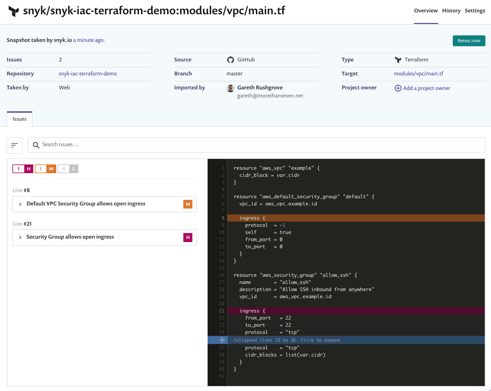
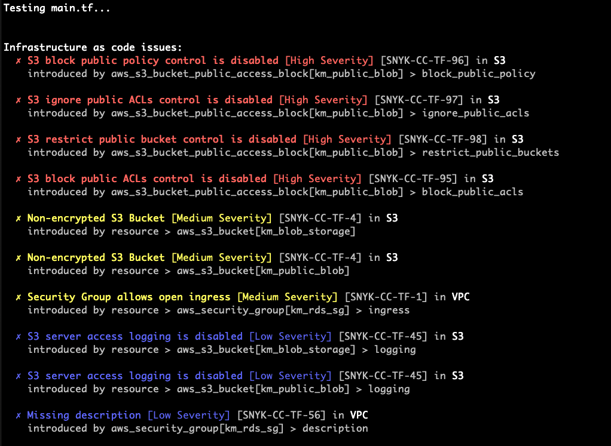

# Snyk Infrastructure as Code Demo

This repository contains a hello world example which demonstrates the Terraform features of Snyk Infrastructure as code. In particular:

* Detecting CIS Benchmark issues for the AWS Terraform provider

## Snyk UI Projects

When this repository is imported into Snyk we should scan the `.tf` files and identify any issues. This should appear in Snyk like so:

Clicking on the individual projects will show the Terraform code, along with details of the individual issues and where they exist in the code.

## Snyk Cli

After installing the Snyk CLI tool, you will then have the capability of scanning your IAC projects. 

For this example repository, you will first need to pull down the code base to your local enviornment.

Terraform is not required to be installed for any of the following examples.

Once in your root directory for the project you can run `snyk iac test` which will recursively identify any of your `.tf` files in the project.

If you would like to specify a file, it can be added by with the filepath to the file location. ex: `snyk iac test ./modules/storage/main.tf`

### Terraform plan ouput

One thing which was recently added is the ability to scan the plan output. 

This can be done by running `snyk iac test tf-plan.json` while in the root directory of this repo.

The plan output is a list of instructions used by terraform which defines what resources will be deployed, if the configuration were to be applied at that very moment. One thing companies will sometimes do, is create that plan output for when they are ready to deploy this configuration to each of their enviornments.

With Snyk there are two different options we have for scanning the plan file.
1. Resource changes `snyk iac test tf-plan.json --scan=resource-changes` - any resource changes including third party resources and variables that are different from the current state file (i.e What is currently deployed in your cloud environments).
2. Planned values `snyk iac test tf-plan.json --scan=planned-values` - a full view of every resource including third party resources and variables regardless of the current state of deployed resources. (i.e If this configuration was deployed for the first time today, how secure would it be.)

The plan output holds vulnerable information such as secret variables and access credentials and should typically not be commited into SCM.

For this example, we have commited the file `tf-plan.json` with that secret information for demonstration purposes. The credentials have been deactivated for security reason.

When scanning the plan file, we are looking for vulnerabilities in all of the resources which will be deployed on the next execution of `terraform apply tfplan.binary` which is applying the configuration related to the plan output, but in the machine readble format.

It's worth noting that not all configuration files are detected in our default scans. This is mostly due to the ability to use third party modules when attempting to deploy resources quickly. The plan output scan is a good way to see the FULL view of what is being deployed and not just the code which the customers manage.
